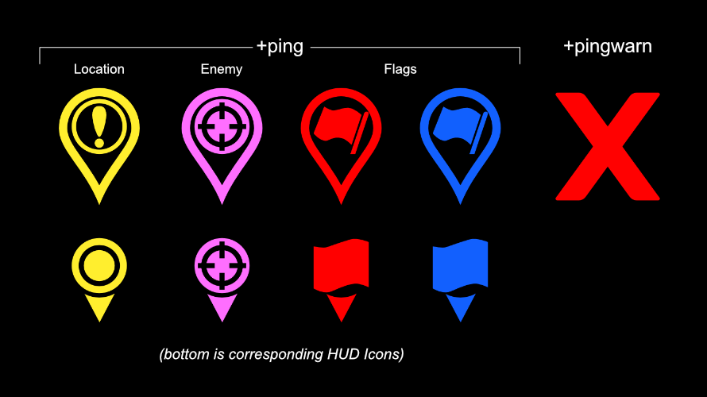
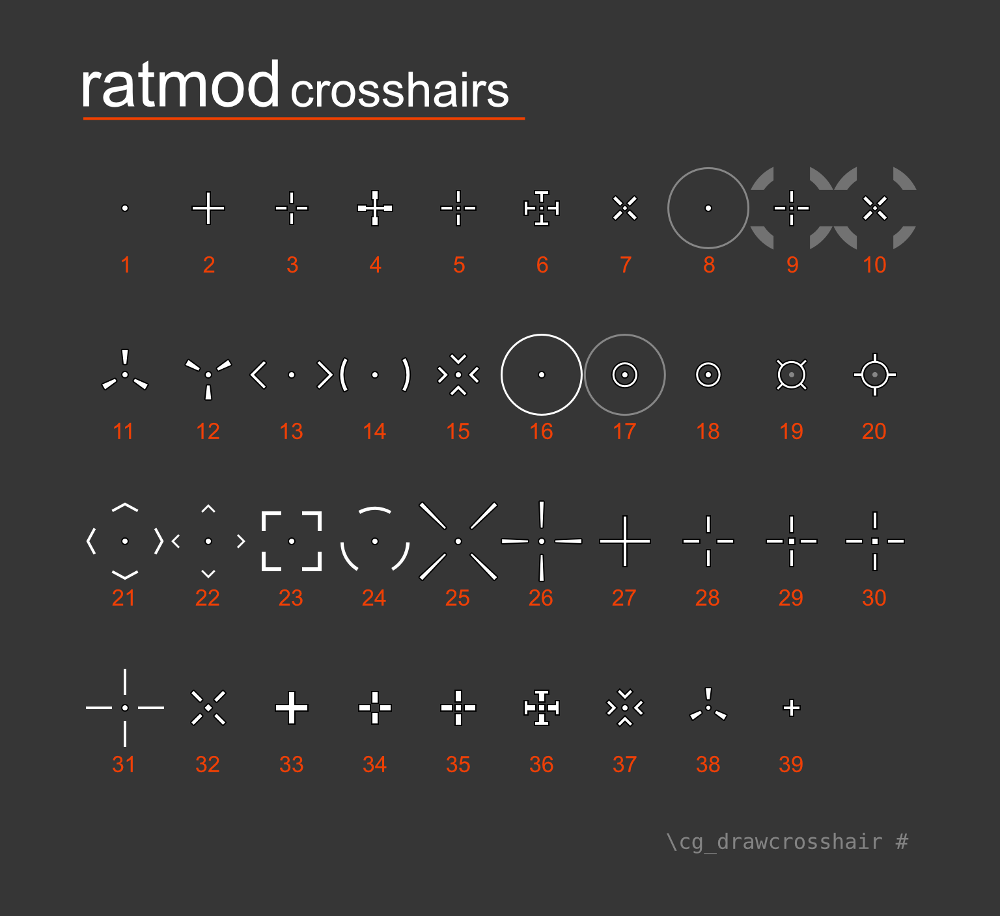
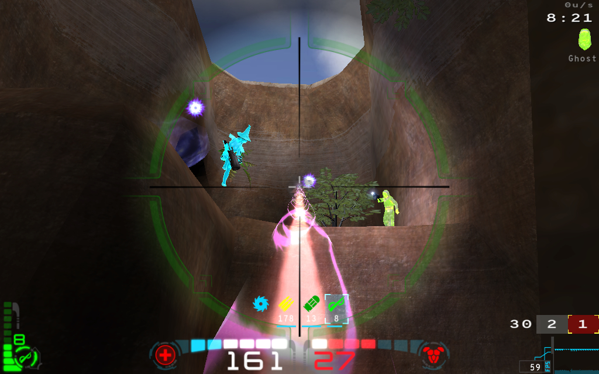

# Ratmod Features

There are a variety of ratmod-specific features. They have more detail here:

## Pings

The pings are designed to be a communication tool between team mates. Text-based messages can be difficult to see and read quickly. On the other hand, a visual ping with a sound is quickly understood. This can easily be used in combination with voice communication. The pings will be placed in the spot where your crosshairs are pointed at. There are two binds to use:

### 1. `bind <key> +ping`
- All of these pings will be shown to your teammates and they will hear a ping sound. If it is out of their field of view, a pointer will show up in their HUD (on the sides) showing them the direction of the ping.
- These pings are meant to draw attention to something, whether it be to "go there", or "enemy is over here" or "the flag is over there" etc. 
- If you point at an empty area (wall or floor), this will show a location ping to your teammates. 
- If you ping in close proximity to an enemy, the icon will change automatically to indicate that an enemy is there.
- If you ping in close proximity to your flag in CTF, a flag ping will be shown to your teammates. If you are carrying the flag and die, using the bind will show your teammates where the dropped flag is.
- Using `+ping` right after you die will also produce a localized X and sound for nearby players.

### 2. `bind <key> +pingwarn`
- This will show an "X" icon with an error-type sound.
- Unlike `+ping`, this is not global - it is not shown on HUD and the sound will not be heard far away. It is intended for communicating to players close to you.
- Use this to warn your teammates of some danger. It can mean "Don't go there", "Stop", "Caution!" etc.

### Configuration Options:

- `cg_pingLocation` - change the ping location icon style (1-3)
- `cg_pingEnemyStyle` - change the enemy ping icon style (1-3)
- `cg_pingLocationTime` - change the amount of time the outer icon is displayed for
- `cg_pingLocationTime2` - change the amount of time the inner icon is displayed for

Here are what the icons look like, but in game they have some visual effects (scale and fade etc):

## The Team Queue System

There is now a queue system available for team-based modes. The intention of this system is to make sure the teams have equal numbers. It only allows people to join in pairs, which ensures that joining players cannot create unequal teams.

This is not yet on by default and it is a vote: `\cv custom queues`

- All people waiting in queue will be shown on the scoreboard. Red "queue" text means the player is waiting to join the red team. Blue text for blue team. White text is for those who auto-joined.
- All people waiting in queue will be spectating the game and will have a message on their screen "Waiting to join team (red/blue)

### Joining Games
When the queue system is turned on, this is how it handles a few common situations:

#### Situation: A player wants to be ready to play...
A good way to indicate that you want to play is just to join. Other spectators can then see on the scoreboard that you want to play and which team you want to join. As soon as someone else joins the opposite team or auto-join, you will enter the game.

#### Situation: spectators want to join the game...
- If someone from spectators tries to join a team, they will go into the queue.
- For example, Player A joins red and is in queue for red. When Player B joins blue, they will both be added to the game. 
- If Player B accidentally joins red, both players will be in the queue for the red team. Without the queue system, both players would be on team red and team red would win!

### Balancing
In addition to the queues, the vote also enables a re-balancing system that makes sure the teams have equal numbers of players even if players leave during the game:

#### Situation: A player leaves a team...
- If the teams become unequal because one or more of the players leave, then the game will equalize the player numbers. The server will wait for a few moments before taking action. 
- In XTERM/CA this balancing will happen after the current round is finished. In CTF it will happen after a few moments. The server will also display messages in the console and on the screen that this will happen.
- Who is put into the queue? The last player who joined will be put back into his team's queue. In the case that all players joined at the same time it will be the one with the lowest score.

#### Situation: Two players want to switch teams
- The queue system makes it easier to handle players switching to opposite teams. 
- Player A switches from blue to red and will be in the red queue. If someone doesn't switch very soon from red to blue, the server will equalize the number of players - moving a red player to the queue.

## Crosshairs

A variety of crosshairs have been added for the sake of variety but also to address some clarity issues. Another point was to provide some varying sizes of similar crosshairs. (There is an in-game mechanism to adjust the crosshair size but that unfortunately does not always result in a crisp crosshair.)

### Crosshair Map
Here is a map of the current crosshair selection with their respective crosshair numbers in red:

### Setting Up Crosshairs
If you just want to use one crosshair, you can use the UI menu or you have two cvars to play with: `cg_drawcrosshair [num]` and `cg_crosshairsize [num]`.

You can set up different crosshairs for each weapon. You must set `cg_differentCrosshairs 1` first, then you can set each weapon individually. You can copy the following into your config and change the [num] for each to suit your preference.

set cg_differentCrosshairs 1
set cg_ch1  [num] // gauntlet
set cg_ch2  [num] // machine gun
set cg_ch3  [num] // shotgun
set cg_ch4 [num] // grenade launcher
set cg_ch5 [num] // rocket launcher
set cg_ch6 [num] // lightning gun
set cg_ch7 [num] // rail gun
set cg_ch8 [num] // plasma gun 
set cg_ch9 [num] // bfg
set cg_ch10 [num] // grapple
set cg_ch11 [num] // nail gun 
set cg_ch12 [num] // proximity mine 
set cg_ch13 [num] // chain gun

*Note: the default size for each weapon's crosshair is `30`. If you would like to adjust that, append size to the cvars listed above. Example set `cg_ch3size 25` to set shotgun crosshair size to 25.*

#### Other Notes:
- Clarity and sharpness of crosshairs seems to be affected by texture quality settings. Low settings will result in crosshairs that aren't sharp. It's recommended to use high quality texture settings. 
- Original Open Arena crosshairs are not available now in ratmod. 

## Zoom Scopes

There are two zoom scopes available in Ratmod. One for machine gun and one for rail gun. These scopes darken the outer edges of the screen and help you focus in on your target.

Turn on zoom scopes on with `cg_drawzoomscope 1`.

Machine Gun Zoom Scope: | Rail Gun Zoom Scope:
----------------------- | --------------------
 | 

### Configure the Zoom Scopes:
There are some options to configure the scopes to your liking (the values listed are the default values): 

- Scale the scope with `cg_zoomscopesize 1.0`. This takes a float value.
- Rail Gun Scope Color `cg_zoomscopeRGcolor "H120 1.0 0.5"`
- Machine Gun Scope Color `cg_zoomscopeMGcolor "H60 1.0 0.5"`

To configure the color, use HSL (Hue, Saturation, Lightness) format. The H value accepts a number from 0 to 360. The S and L values accept a float value from 0.0 to 1.0. 

By default the colors are green for the rail scope and yellow for the machine gun scope. They are also at 50% lightness. If you would simply like more color, change the L value to 1.0. (ie H120 1 1)

*Note: By default OA uses a zoom animation and the zoom scope will appear when that animation has finished - fully zoomed in. If you would like your zoom to be at full zoom instantly and also the scope to appear instantly set `cg_zoomanim 0`*

## Rocket Styles

There are different visual styles of rockets available. Set it with `cg_rocketstyle`.

